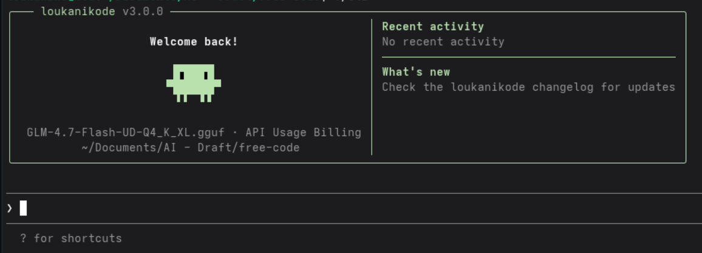

<p align="center">
  
</p>

<h1 align="center">loukanikode</h1>

<p align="center">
  <strong>The free build of Claude Code.</strong><br>
  All telemetry stripped. All guardrails removed. All experimental features unlocked.<br>
  100% offline with your local llama.cpp server.
</p>

<p align="center">
  <a href="#quick-install"></a>
  <a href="https://github.com/loukaniko85/loukanikode/stargazers"></a>
  <a href="https://github.com/loukaniko85/loukanikode/issues"></a>
</p>

---

## Quick Install

```bash
curl -fsSL https://raw.githubusercontent.com/loukaniko85/loukanikode/main/install.sh | bash
```

Checks your system, installs Bun if needed, clones the repo, builds with all experimental features enabled, and symlinks `loukanikode` on your PATH.

Then run `loukanikode` and start chatting with your local model.

---

## Table of Contents

- [What is this](#what-is-this)
- [Requirements](#requirements)
- [Quick Start](#quick-start)
- [Build](#build)
- [Usage](#usage)
- [Configuration](#configuration)
- [Experimental Features](#experimental-features)
- [Project Structure](#project-structure)
- [Tech Stack](#tech-stack)
- [Contributing](#contributing)
- [License](#license)

---

## What is this

A clean, buildable fork of Anthropic's Claude Code CLI -- the terminal-native AI coding agent. The upstream source became publicly available through a source map exposure in the npm distribution.

This fork is designed specifically for **local, offline usage** with llama.cpp. No API keys. No cloud. No telemetry.

### Telemetry removed

- All outbound telemetry endpoints are dead-code-eliminated or stubbed
- No crash reports, no usage analytics, no session fingerprinting

### Security-prompt guardrails removed

- Anthropic's injected system-level constraints stripped
- The model's own safety training still applies

### Experimental features unlocked

54 of 88 feature flags that compile cleanly are enabled. See [Experimental Features](#experimental-features) below.

---

## Requirements

- **Runtime**: [Bun](https://bun.sh) >= 1.3.11
- **OS**: macOS or Linux (Windows via WSL)
- **Local model**: Any `.gguf` model running on llama.cpp server

```bash
# Install Bun if you don't have it
curl -fsSL https://bun.sh/install | bash
```

---

## Quick Start

### 1. Start your llama.cpp server

```bash
llama-server \
  -m /path/to/your/model.gguf \
  --host 0.0.0.0 \
  --port 8080 \
  --ctx-size 4096 \
  -ngl 32
```

### 2. Configure loukanikode

Create a `.env` file in the project root:

```bash
LLAMA_CPP_SERVER=http://localhost:8080/v1
LOUKANIKODE_USE_LLAMA=1
LLAMA_CPP_MODEL=your-model-name.gguf
```

### 3. Run

```bash
./cli
```

That's it. Fully offline. No API keys. No accounts.

---

## Build

```bash
git clone https://github.com/loukaniko85/loukanikode.git
cd loukanikode
bun run build
./cli
```

### Build Variants

| Command | Output | Features | Description |
|---|---|---|---|
| `bun run build` | `./cli` | `VOICE_MODE` only | Production-like binary |
| `bun run build:dev` | `./cli-dev` | `VOICE_MODE` only | Dev version stamp |
| `bun run build:dev:full` | `./cli-dev` | All 54 experimental flags | Full unlock build |
| `bun run compile` | `./dist/cli` | `VOICE_MODE` only | Alternative output path |

---

## Usage

```bash
# Interactive REPL (default)
./cli

# One-shot mode
./cli -p "what files are in this directory?"

# Run from source (slower startup)
bun run dev
```

---

## Configuration

### Environment Variables

| Variable | Purpose |
|---|---|
| `LLAMA_CPP_SERVER` | Llama.cpp server URL (e.g. `http://localhost:8080/v1`) |
| `LOUKANIKODE_USE_LLAMA` | Enable llama.cpp mode (set to `1`) |
| `LLAMA_CPP_MODEL` | Model name to use |
| `LLAMA_API_KEY` | Optional API key if your server requires auth |
| `LLAMA_TIMEOUT_MS` | Request timeout in milliseconds (default: 300000) |

### Config Directory

loukanikode stores its configuration in `~/.loukanikode/`.
You can override this with the `LOUKANIKODE_CONFIG_DIR` environment variable.

### Backward Compatibility

For users migrating from the original fork: `CLAUDE_CODE_*` environment variables are
still supported as fallbacks. If a `LOUKANIKODE_*` variable is not set, the application
will automatically check for the corresponding `CLAUDE_CODE_*` variable.

---

## Experimental Features

The `bun run build:dev:full` build enables all 54 working feature flags. Highlights:

### Interaction & UI

| Flag | Description |
|---|---|
| `ULTRAPLAN` | Remote multi-agent planning |
| `ULTRATHINK` | Deep thinking mode -- type "ultrathink" to boost reasoning effort |
| `VOICE_MODE` | Push-to-talk voice input and dictation |
| `TOKEN_BUDGET` | Token budget tracking and usage warnings |
| `HISTORY_PICKER` | Interactive prompt history picker |
| `MESSAGE_ACTIONS` | Message action entrypoints in the UI |
| `QUICK_SEARCH` | Prompt quick-search |
| `SHOT_STATS` | Shot-distribution stats |

### Agents, Memory & Planning

| Flag | Description |
|---|---|
| `BUILTIN_EXPLORE_PLAN_AGENTS` | Built-in explore/plan agent presets |
| `VERIFICATION_AGENT` | Verification agent for task validation |
| `AGENT_TRIGGERS` | Local cron/trigger tools for background automation |
| `EXTRACT_MEMORIES` | Post-query automatic memory extraction |
| `COMPACTION_REMINDERS` | Smart reminders around context compaction |
| `CACHED_MICROCOMPACT` | Cached microcompact state through query flows |
| `TEAMMEM` | Team-memory files and watcher hooks |

### Tools & Infrastructure

| Flag | Description |
|---|---|
| `BRIDGE_MODE` | IDE remote-control bridge (VS Code, JetBrains) |
| `BASH_CLASSIFIER` | Classifier-assisted bash permission decisions |
| `PROMPT_CACHE_BREAK_DETECTION` | Cache-break detection in compaction/query flow |

See [FEATURES.md](FEATURES.md) for the complete audit of all 88 flags, including 34 broken flags with reconstruction notes.

---

## Project Structure

```
scripts/
  build.ts                # Build script with feature flag system

src/
  entrypoints/cli.tsx     # CLI entrypoint
  commands.ts             # Command registry (slash commands)
  tools.ts                # Tool registry (agent tools)
  QueryEngine.ts          # LLM query engine
  screens/REPL.tsx        # Main interactive UI (Ink/React)

  commands/               # /slash command implementations
  tools/                  # Agent tool implementations (Bash, Read, Edit, etc.)
  components/             # Ink/React terminal UI components
  hooks/                  # React hooks
  services/               # API clients, MCP, analytics
    api/                  # API client + llama fetch adapter
  state/                  # App state store
  utils/                  # Utilities
    model/                # Model configs, providers, validation
  skills/                 # Skill system
  plugins/                # Plugin system
  bridge/                 # IDE bridge
  voice/                  # Voice input
  tasks/                  # Background task management
```

---

## Tech Stack

| | |
|---|---|
| **Runtime** | [Bun](https://bun.sh) |
| **Language** | TypeScript |
| **Terminal UI** | React + [Ink](https://github.com/vadimdemedes/ink) |
| **CLI Parsing** | [Commander.js](https://github.com/tj/commander.js) |
| **Schema Validation** | Zod v4 |
| **Code Search** | ripgrep (bundled) |
| **Protocols** | MCP, LSP |
| **Local LLM** | llama.cpp (OpenAI-compatible API) |

---

## Contributing

Contributions are welcome. If you're working on restoring one of the 34 broken feature flags, check the reconstruction notes in [FEATURES.md](FEATURES.md) first.

1. Fork the repository
2. Create a feature branch (`git checkout -b feat/my-feature`)
3. Commit your changes (`git commit -m 'feat: add something'`)
4. Push to the branch (`git push origin feat/my-feature`)
5. Open a Pull Request

---

## License

The original Claude Code source is the property of Anthropic. This fork exists because the source was publicly exposed through their npm distribution. Use at your own discretion.
